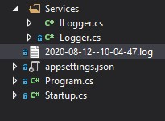

# Module 3: Configuring Middleware and Services in ASP.NET Core

# Lesson 2: Configuring Services

### Demonstration: How to Use Dependency Injection

Añadimos el metodo **configure** :


```cs
    public void Configure(IApplicationBuilder app)
    {
        app.Run(async (context) =>
        {
            await context.Response.WriteAsync("This text was generated by the app.Run middleware.");
        });
    }
```


Añadimos las carpeta **Services** y una clase que llamaremos **Logger** que implementa el interface **ILogger**

Añadimos su constructor y un metodo Log:

```
 		string _fileName;

        public Logger()
        {
            _fileName = $"{DateTime.UtcNow.ToString("yyyy-dd-MM--HH-mm-ss")}.log";
        }


        public void Log(string logData)
        {
            File.AppendAllText(_fileName, $"{DateTime.UtcNow}: {logData}");
        }
```

En el middleware inyectamos la dependencia a este servicio:


```
 		 public void ConfigureServices(IServiceCollection services)
        {
            services.AddSingleton<ILogger, Logger>();
        }

        public void Configure(IApplicationBuilder app, ILogger logger)
        {
            app.Run(async (context) =>
            {
                logger.Log("Logged line");
                await context.Response.WriteAsync("This text was generated by the app.Run middleware.");
            });
        }
```

Vemos que crea un fichero de log:


